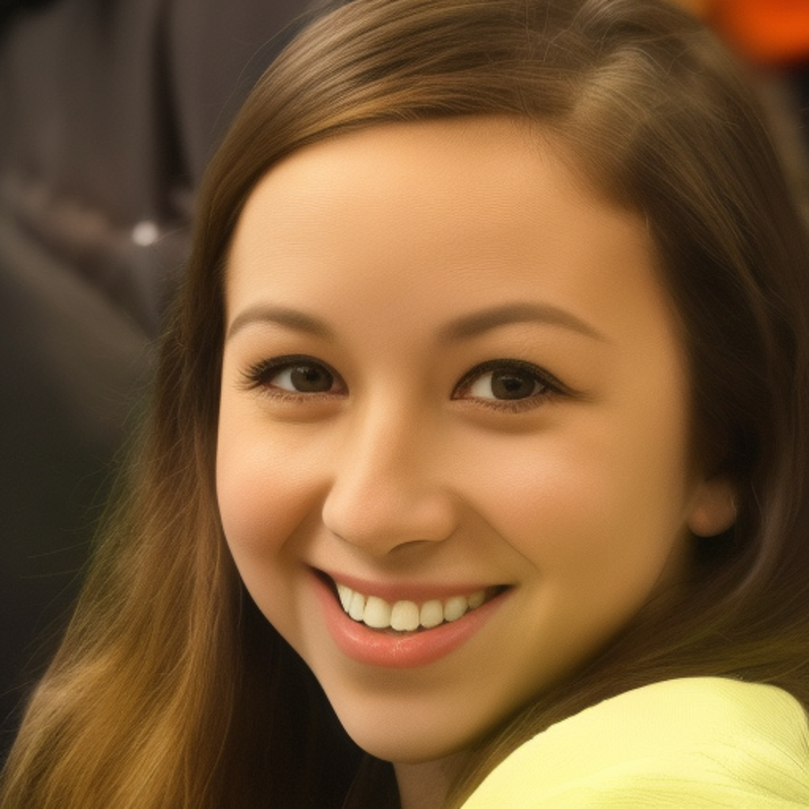
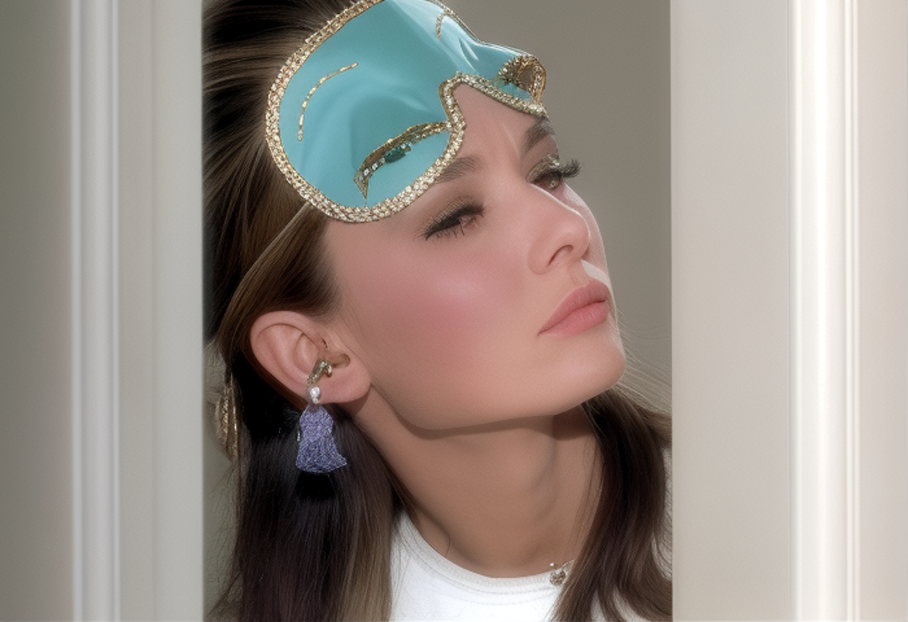

# ComfyUI DiffBIR

Comfyui-DiffBIR is a comfyui implementation of offical DiffBIR. DiffBIR v2 is an awesome super-resolution algorithm. If you find this repo helpful, please don't hesitate to give it a star. Thank you! ❤️❤️❤️

---

TODO:
- **2024.05.10** ✅ repo create
- **2024.05.11** ✅ sampler implement
- **2024.05.11** ✅ stage2 load implement
- **2024.05.12** ✅ stage1 load implement
- **2024.05.12** ✅ stage1 tile implement
- **2024.05.12** ✅ simple load implement
- **2024.05.12** ✅ sampler update
- **2024.05.12** ✅ sampler advanced
- **2024.05.14** ✅ readme update
- **2024.05.14** ✅ bsr workflow
- **2024.05.16** ✅ bfr support
- **2024.05.16** ✅ bid support
- **2024.05.16** ✅ bfr and bid workflow
- **2024.05.21** ✅ support fp16 inference, now it can run on an 8GB GPU
- [ ] multi images support
- [ ] stage1 and stage2 sampler split

# Visual Results
## Blind Image Super-Resolution
|        low resolution image       |       super resolution image      |
|:---------------------------------:|:---------------------------------:|
|    | |
|     | |

## Blind Face Restoration
|        low resolution image       |       super resolution image      |
|:---------------------------------:|:---------------------------------:|
|    | |
|     | |

## Blind Image Denoising
|        low resolution image       |       super resolution image      |
|:---------------------------------:|:---------------------------------:|
|    | |
|     | |

# Installing
### Step 1: clone the repo and install the dependencies
To install ComfyUI-DiffBIR in addition to an existing installation of ComfyUI, you can follow the following steps:
1. `cd custom_nodes`  
2. `git clone https://github.com/ComfyUI/ComfyUI-DiffBIR`  
3. `pip install -r requirements.txt`
4. Restart ComfyUI

### Step 2: download the pretrained model
put the models into `ComfyUI/models/diffbir/`
|      model     |                                                          download link                                                         | Baidu Netdisk |
|:--------------:|:------------------------------------------------------------------------------------------------------------------------------:|---------------|
|     bsrnet     | [BSRNet.pth](https://github.com/cszn/KAIR/releases/download/v1.0/BSRNet.pth)                                                   |               |
|   swinir_face  | [face_swinir_v1.ckpt](https://huggingface.co/lxq007/DiffBIR/resolve/main/face_swinir_v1.ckpt)                                  |               |
|   scunet_psnr  |          [scunet_color_real_psnr.pth](https://github.com/cszn/KAIR/releases/download/v1.0/scunet_color_real_psnr.pth)          |               |
| swinir_general | [general_swinir_v1.ckpt](https://huggingface.co/lxq007/DiffBIR/resolve/main/general_swinir_v1.ckpt)                            |               |
|       v2       | [v2.pth](https://huggingface.co/lxq007/DiffBIR-v2/resolve/main/v2.pth)                                                         |               |
|     sd_v21     | [v2-1_512-ema-pruned.ckpt](https://huggingface.co/stabilityai/stable-diffusion-2-1-base/resolve/main/v2-1_512-ema-pruned.ckpt) |               |

# Workflows
|           task           |                              workflow                                  |
|:------------------------:|:----------------------------------------------------------------------:|
| Blind Super Resolution   |  [  bsr_workflow.json  ](  example_workflows/bsr_workflow_fp32.json  ) |
| Blind Face Restoration   |  [  bfr_workflow.json  ](  example_workflows/bfr_workflow_fp32.json  ) |
| Blind Image Denoising    |  [  bid_workflow.json  ](  example_workflows/bid_workflow_fp32.json  ) |